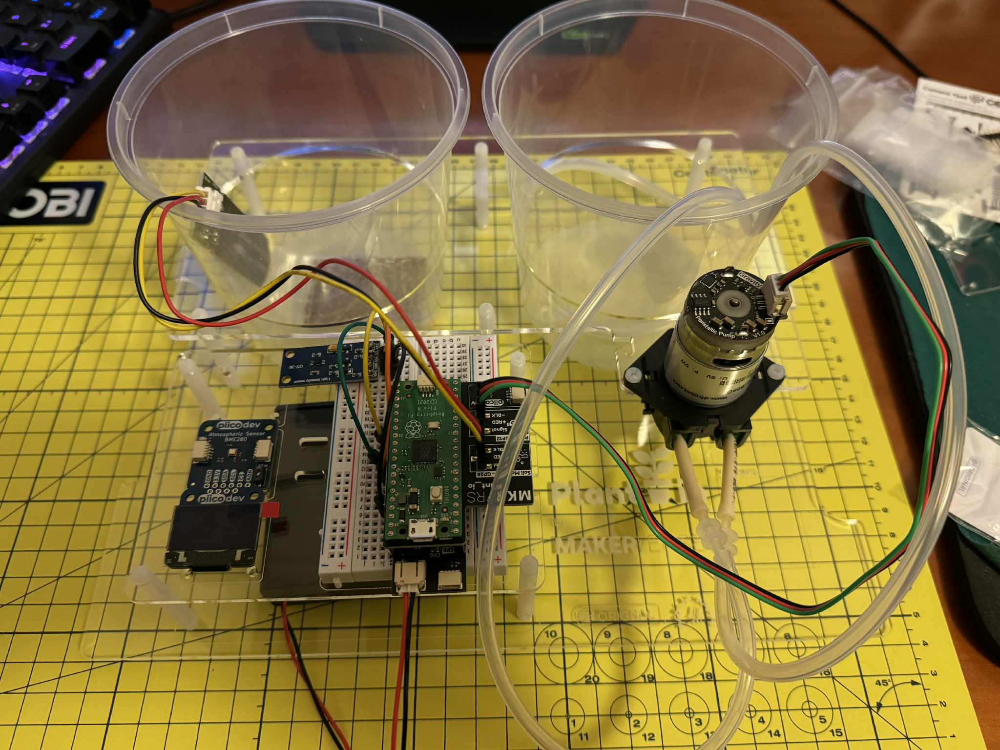

# Automated Plant Irrigation System 

A small open-source platform for automating basic plant care.  
Built with a **Raspberry Pi Pico** and PiicoDev-compatible sensors, this system logs environmental data (light, soil moisture and atmosphere) and controls a peristaltic water pump for irrigation.  

---

## Features Implemented
- **Sensor Integration** – soil moisture and atmospheric sensors connected over I²C  
- **Pump Control** – Pico drives a peristaltic pump for automated irrigation  
- **Data Logging** – records sensor values for monitoring plant health onto the Pico  
- **Modular Setup** – designed as a small platform that can be extended with additional sensors or outputs  

---

**Pico Setup**
-   

---

## Key Learnings
- Microcontroller programming with Raspberry Pi Pico (MicroPython)  
- Working with I²C daisy-chained sensor modules  
- Hardware/software debugging and validation  
- Basics of automated irrigation systems  

---

## Next Steps
- Integrate a mini OLED display for live feedback
- Expand data logging with timestamps and external storage  

---

## Tools & Components
- Raspberry Pi Pico
- Makerverse Shim
- NANO Power Timer Hat
- PiicoDev atmospheric sensor
- PiicoDev OLED module
- GY-30 Light Intensity Sensor
- Soil Moisture Sensor 
- PiicoDev cable system (I²C)
- Peristaltic water pump  
- Breadboard and jumper wires
- 4x AA NiMH Batteries
- Battery Pack

---

## Credits
This project was built using [PiicoDev modules](https://core-electronics.com.au/piicodev) developed by **Core Electronics**.  
Schematics and code examples are open source and provided under their respective licenses.  
